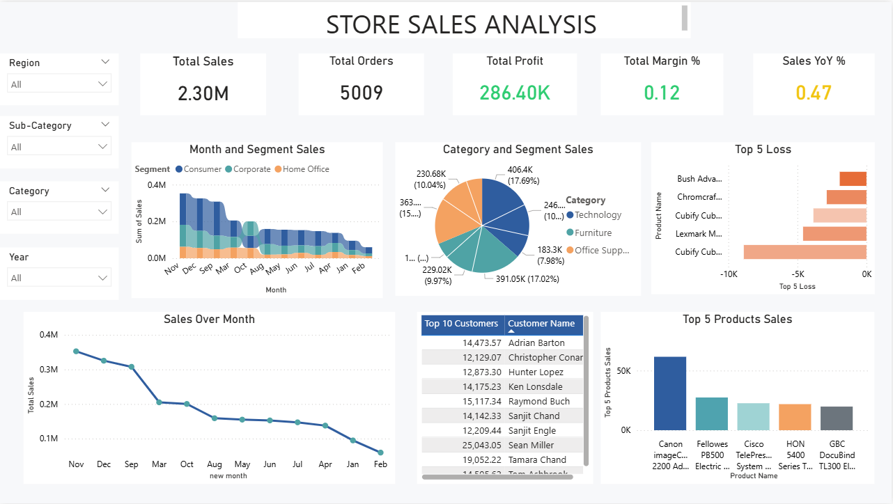

# store-sales

About the Project
This project focuses on analyzing store sales data using Power BI to understand business performance, sales trends, and profitability.
The goal of this dashboard is to provide clear insights into sales, profit, category performance, and regional trends to support better business decision-making.

Objective
Analyze overall sales and profit performance
Identify top-performing products and categories
Understand regional sales distribution
Track key business KPIs
Provide data-driven insights through interactive dashboards

Tools Used
Power BI
Data Modeling
DAX (Data Analysis Expressions)
Data Cleaning & Transformation (Power Query)

Dashboard Features
Total Sales & Profit KPIs
Category-wise Sales Analysis
Region-wise Performance
Time-based Trend Analysis
Interactive Filters & Slicers

Key Insights
Certain product categories generate higher profit margins.
Sales performance varies across regions.
Seasonal trends impact overall revenue.
Some products have high sales but lower profitability.

Conclusion
This project demonstrates my ability to transform raw sales data into meaningful business insights using Power BI. By analyzing sales trends, profitability, and regional performance, I was able to identify key growth opportunities and performance gaps.
The dashboard provides a clear and interactive view of business KPIs, helping stakeholders make informed and data-driven decisions.
Overall, this project strengthened my skills in data visualization, dashboard design, DAX calculations, and business analysis.
